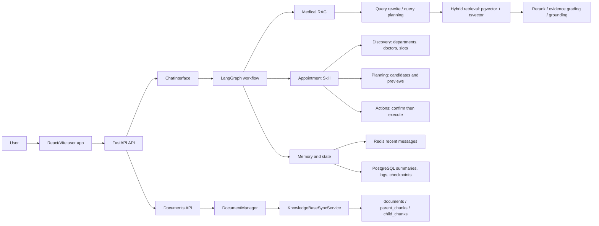

<div align="center">

# LangGraph Medical RAG + Appointment Skill

**A production-style medical assistant demo with RAG, stateful workflows, memory, and controlled appointment actions.**

[](https://www.python.org/)


[](LICENSE)

**Medical QA · Hybrid Retrieval · Session Memory · Appointment Booking · Cancellation · Knowledge Base Sync**

[Quick Start](#quick-start) · [Architecture](#architecture) · [Benchmarks](#benchmarks) · [API](#api-surface) · [Docs](#documentation)

</div>


> The demo shows the React/Vite user app. The current frontend has a product-style chat workspace, Documents page, theme toggle, message search, chat export, keyboard shortcuts, PWA support, and safer error/loading states. Gradio is kept as an admin/debug console.

## Why This Project Exists

Most RAG demos answer one question from a few documents. This project is closer to a real assistant product:

- It answers medical questions with retrieval, evidence checks, citations, and safe fallback behavior.
- It manages multi-turn state with Redis memory, summaries, topic focus, and pending workflow state.
- It handles appointment/cancellation as a controlled skill: discover options, prepare a preview, then require explicit confirmation.
- It supports a continuously updateable knowledge base through local upload, official-source sync, soft delete, and re-indexing.
- It ships with regression tests and benchmark scripts for routing, memory, retrieval, and answer quality.

## Feature Highlights

| Area | Capability |
| --- | --- |
| LangGraph orchestration | Routes medical QA, triage, booking, cancellation, clarification recovery, and compound turns |
| Medical RAG | Parent-child chunking, dense + sparse retrieval, RRF fusion, rerank, evidence sufficiency, grounding checks |
| Memory | Redis recent context, LLM summaries, topic focus, pending action state, and persistent checkpoints |
| Appointment Skill | Department discovery, doctor/slot discovery, booking preview, cancellation preview, explicit confirmation |
| Knowledge base | Local document upload, official source sync, content-hash update detection, soft delete, import history |
| Frontend split | FastAPI API, SSE chat stream, React user app, Documents page, theme/search/export/PWA UX, Gradio admin console |
| Safety | High-risk symptom handling, medication caution, low-evidence general medical fallback with disclaimer |

## Architecture



### Runtime Roles

- **React frontend** is the user-facing product surface for chat and lightweight knowledge-base management.
- **FastAPI** exposes chat SSE, system status, Documents APIs, and frontend/backend adapters.
- **Gradio** remains an internal admin console for advanced diagnostics and manual operations.
- **PostgreSQL + pgvector** is the source of truth for documents, chunks, appointments, logs, and summaries.
- **Redis** stores short-term conversational memory and recoverable session state.

## Typical Workflows

### Medical QA With Evidence

```text
User: 高血压应该注意什么？
Assistant: Answers with lifestyle, monitoring, medication adherence, and follow-up advice, with source references when evidence is available.
```

### Low-Evidence Medical Fallback

```text
User: 感冒发烧怎么办？
Assistant: Gives general medical information, clearly labels that the answer is not sufficiently knowledge-base grounded, and reminds the user to seek care if symptoms worsen.
```

### Controlled Booking

```text
User: 我想挂号
Assistant: Shows available departments or asks for symptoms.
User: 呼吸内科
Assistant: Lists available doctors and slots.
User: 我要预约张医生 2026-04-18 下午
Assistant: Creates a preview and asks for “确认预约”.
User: 确认预约
Assistant: Executes the booking once, with idempotency protection.
```

### Workflow Interruption

```text
User: 我要挂呼吸内科张医生明天下午的号
Assistant: Creates a booking preview.
User: 对了，咳嗽三天了需要拍片吗？
Assistant: Answers the medical question while keeping the pending booking state.
User: 确认预约
Assistant: Resumes and confirms the previous booking.
```

## Quick Start

### 1. Install Dependencies

```powershell
python -m venv venv
.\venv\Scripts\Activate.ps1
pip install -r requirements.txt

cd frontend
npm install
cd ..
```

Optional multi-format document parsing:

```powershell
pip install -r requirements-unstructured.txt
```

### 2. Configure Environment

```powershell
Copy-Item project\.env.example project\.env
```

Fill in at least:

- LLM / embedding provider credentials
- PostgreSQL connection settings
- Redis connection settings
- API Bearer token mapping (`API_AUTH_TOKENS_JSON`)

### 3. Start Required Services

You need:

- PostgreSQL with pgvector
- Redis
- one configured LLM / embedding provider

PostgreSQL setup notes are in [docs/POSTGRES_SETUP_CN.md](docs/POSTGRES_SETUP_CN.md).

Development defaults in `project/.env.example` include:

- `demo-admin-token` for the React admin/demo flow
- `demo-user-token` for regular user chat flow

Production note:

- if `REDIS_ENABLED=true` and `APP_ENV!=development`, Redis is required at startup and the API will fail fast instead of silently falling back to in-process memory

### 4. Start the Split Frontend App

```powershell
.\start_frontend_app.ps1 -Restart -SkipInstall
```

Open:

- User frontend: [http://127.0.0.1:5173](http://127.0.0.1:5173)
- API docs: [http://127.0.0.1:8000/docs](http://127.0.0.1:8000/docs)

Manual startup:

```powershell
.\venv\Scripts\python.exe project\api_app.py
```

```powershell
cd frontend
npm run dev
```

### 5. Start the Gradio Admin Console

```powershell
.\venv\Scripts\python.exe project\app.py
```

Open:

- [http://localhost:7860](http://localhost:7860)

Gradio is the admin/debug console. Use it for diagnostics, full knowledge-base management, and development checks. For normal user-facing demos, prefer the React frontend above.

## API Surface

The React app uses these main endpoints:

| Endpoint | Purpose |
| --- | --- |
| `GET /api/health` | API liveness check |
| `GET /api/system/status` | Startup and knowledge-base status |
| `POST /api/chat/session` | Create or reuse a thread id |
| `GET /api/chat/history` | Load visible session history |
| `POST /api/chat/clear` | Clear one thread |
| `POST /api/chat/stream` | Authenticated SSE chat stream |
| `GET /api/documents/status` | Knowledge-base status and recent task summary |
| `GET /api/documents/list` | User-facing document list with source, sync status, and freshness metadata |
| `GET /api/documents/tasks` | Recent import/sync task records |
| `GET /api/documents/sources` | Official-source coverage, recommended use, and expansion notes |
| `POST /api/documents/upload` | Upload files and sync them into the knowledge base |
| `POST /api/documents/sync-official` | Sync one official source |

All `/api/*` routes require `Authorization: Bearer <token>`. Document routes are admin-only.

## Knowledge Base Updates

The knowledge base is updateable, not just one-time import:

- local uploads are converted to Markdown when needed
- each document gets a stable `source_key`
- normalized Markdown content is hashed with SHA-256
- unchanged documents are skipped
- changed documents replace their old chunks in place
- missing official-source documents are soft deleted and removed from retrieval
- recent sync tasks are persisted and surfaced through API/UI

Supported official-source importers currently include:

- MedlinePlus
- NHC whitelist PDFs
- WHO whitelist HTML pages

API startup no longer auto-runs knowledge-base background jobs. Run maintenance explicitly when needed:

```powershell
.\venv\Scripts\python.exe project\kb_jobs.py bootstrap
.\venv\Scripts\python.exe project\kb_jobs.py sync-local --soft-delete-missing
.\venv\Scripts\python.exe project\kb_jobs.py sync-official nhc --limit 5
.\venv\Scripts\python.exe project\kb_jobs.py sync-all
```

## Benchmarks

Bundled benchmark snapshots:

- Long-dialogue memory reduced prompt tokens by **27.4% at P95** in the included benchmark fixture.
- Hybrid retrieval improved **Precision@5 from 0.68 to 0.83** on the bundled NHC/WHO-style medical retrieval benchmark.

Benchmark entrypoints:

```powershell
.\venv\Scripts\python.exe project\benchmarks\evaluate_memory_token_benchmark.py --json
.\venv\Scripts\python.exe project\benchmarks\evaluate_medical_rag_benchmark.py --json
.\venv\Scripts\python.exe project\benchmarks\evaluate_offline_answer_benchmark.py --json
.\venv\Scripts\python.exe project\benchmarks\evaluate_acceptance_report.py --json
```

## Testing

Fast checks:

```powershell
.\venv\Scripts\python.exe -m compileall project tests
.\venv\Scripts\python.exe -m unittest tests.test_api_app -v
cd frontend
npm run build
```

Full regression:

```powershell
.\venv\Scripts\python.exe -m unittest discover -s tests -v
```

Split app smoke:

```powershell
.\scripts\smoke_split_app.ps1 -SkipChat
```

Live chat smoke, if your model provider is configured:

```powershell
.\scripts\smoke_split_app.ps1
```

## Project Structure

```text
project/
  api/                       # FastAPI app, route modules, SSE helpers, DTOs
  core/                      # bootstrap, chat interface, document sync, RAG system
  rag_agent/                 # LangGraph graph, nodes, prompts, tools, state schemas
  services/appointment_skill/# discovery / planning / action skill package
  db/                        # PostgreSQL stores, schema manager, vector DB manager
  memory/                    # Redis memory and summary persistence
  ui/                        # Gradio admin/debug console
  benchmarks/                # memory, retrieval, route, answer-quality benchmarks
frontend/
  src/pages/                 # Chat and Documents pages
  src/hooks/                 # chat, status, and documents state hooks
  src/components/            # reusable UI components
  src/lib/                   # API and SSE helpers
  src/constants/             # frontend constants and status mapping
scripts/                     # smoke and maintenance scripts
tests/                       # unit, regression, and live DB tests
docs/                        # project guide, setup, sequence diagrams, QA notes
assets/                      # README demo media
```

## Documentation

- [Frontend/backend split architecture](docs/architecture/frontend_backend_split.md)
- [FastAPI API layer notes](project/api/README.md)
- [Project guide, Chinese](docs/PROJECT_GUIDE_CN.md)
- [Sequence diagrams and source walk-through, Chinese](docs/PROJECT_SEQUENCE_CN.md)
- [PostgreSQL setup, Chinese](docs/POSTGRES_SETUP_CN.md)
- [Medical import guide](docs/MEDICAL_IMPORT.md)
- [Medical sources guide](docs/MEDICAL_SOURCES.md)
- [QA evaluation guide](docs/QA_EVAL.md)
- [Contributing guide](CONTRIBUTING.md)

## Data and Repository Hygiene

The repository intentionally does **not** commit runtime data:

- `markdown_docs/`
- `runtime/`
- `output/`
- `parent_store/`
- `qdrant_db/`
- `frontend/dist/`
- `frontend/node_modules/`
- `.env` / `project/.env`

Use `project/.env.example` as the template for local configuration.

## Safety Scope

This is an engineering demo for medical information assistance and workflow orchestration.

It is **not** a medical device, does **not** provide diagnosis, and does **not** replace licensed clinicians. High-risk symptoms, medication-dose questions, and low-evidence answers are handled with more conservative wording and visible safety reminders.

## Roadmap

- Move more admin capabilities from Gradio to dedicated FastAPI/React pages
- Add stronger answer-level evaluation and RAGAS-style reporting
- Improve appointment rescheduling and alternative-slot planning
- Add auth and deployment profiles for real multi-user environments
