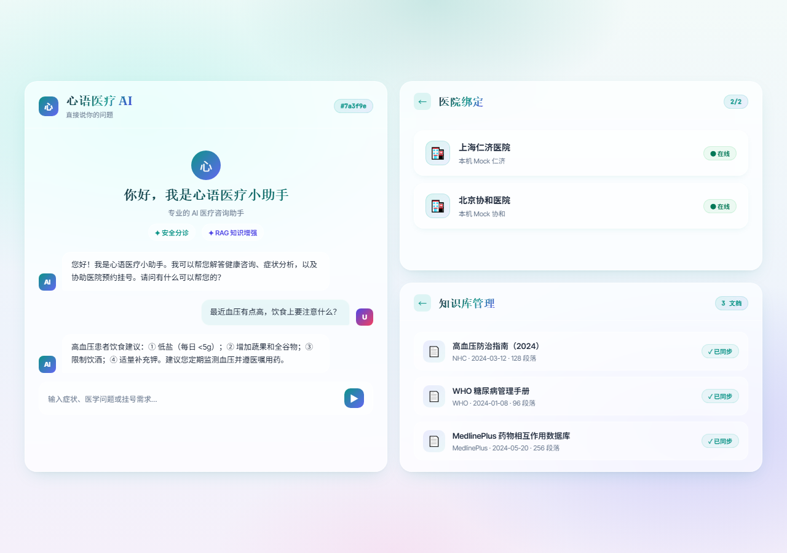
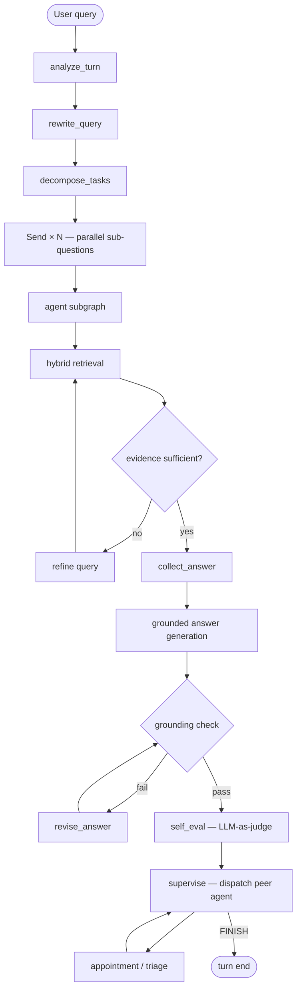
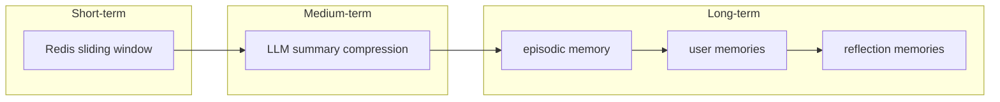
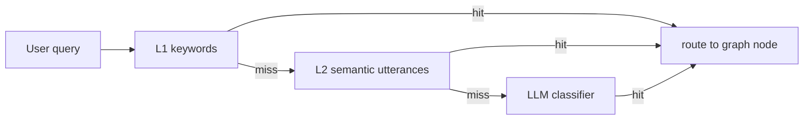
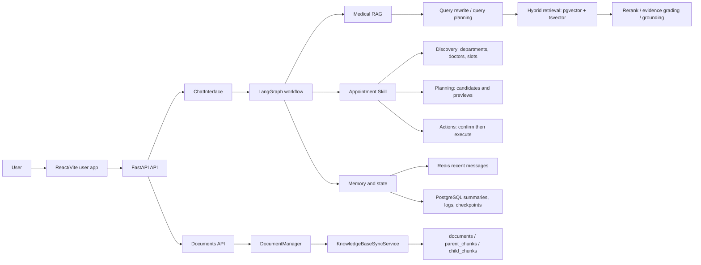
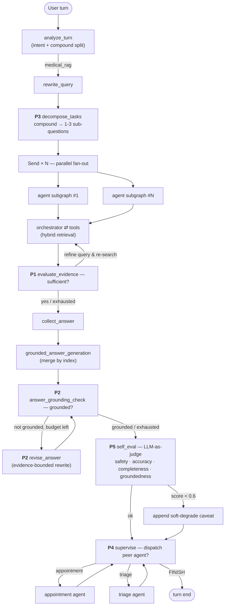

<div align="center">

# 心语医疗助手 · Xinyu Medical Agent

**A production-grade medical AI assistant built with LangGraph — not a RAG demo, but a self-correcting agent with agentic retrieval, cross-session memory, multi-hospital MCP booking, and PII encryption.**

[](https://www.python.org/)


[](LICENSE)

**Medical QA · Hybrid Retrieval · Cross-session Memory · Multi-hospital MCP Booking · PII Encryption**

[Quick Start](#quick-start) · [Architecture](#architecture) · [Agentic Pipeline](#agentic-pipeline-p1p5-from-rag-to-agent) · [Key Metrics](#key-metrics) · [API](#api-surface) · [Docs](#documentation)

</div>



> The React/Vite frontend features an **Aurora glassmorphism design system** — teal/indigo gradients, refined typography, and medical-grade visual clarity across Chat, Documents, and Hospital Binding pages.

## Key Metrics

| Metric | Before | After | Improvement |
|--------|--------|-------|-------------|
| End-to-end P50 latency | 167s | **17s** | **10×** |
| RAG Precision@5 | 0.68 | **0.83** | +22% |
| Top-1 hit rate | 0.61 | **0.79** | +30% |
| 30-turn prompt tokens | baseline | **-27.4%** | summary compression |
| Cross-session fact recall | — | **74%** | pgvector user memory |

## Why This Project Exists

Most RAG demos answer one question from a few documents. This project is closer to a real assistant product:

- It answers medical questions with retrieval, evidence checks, citations, and safe fallback behavior.
- It remembers user allergies, medications, and history across sessions (pgvector semantic memory + importance scoring + dedup).
- It handles appointment/cancellation as a controlled skill: discover options, prepare a preview, then require explicit confirmation.
- It connects to multiple hospitals via MCP protocol with per-user encrypted credentials and circuit-breaker isolation.
- It encrypts sensitive medical PII at rest (Fernet column-level encryption with key rotation support).
- It ships with regression tests, benchmark scripts, and a 30-persona stress-test framework.

## Feature Highlights

| Area | Capability |
| --- | --- |
| LangGraph orchestration | Declarative Skill plugin framework — 3-layer intent routing (rule + semantic + LLM), add an intent with 1 class |
| Agentic RAG | Self-correcting retrieval: evidence-reflection loop, task decomposition, answer grounding check, online self-evaluation |
| 3-layer memory | Redis sliding window → LLM summary compression → pgvector cross-session semantic recall with importance scoring |
| MCP multi-hospital | Fernet-encrypted per-user credentials, namespaced tool injection, 3-state circuit breaker per hospital |
| Appointment Skill | Discovery → Preview → Confirm; code-gated state transitions (idempotency + state machine), not LLM judgment |
| Knowledge base | Local document upload, official source sync (NHC/WHO), content-hash update detection, soft delete |
| Security | High-risk symptom alerts, PII column-level encryption, JWT auth + login lockout, rate limiting, audit log |
| Frontend | Aurora glassmorphism UI — responsive, accessible, dark-mode, PWA-ready |

## Core Capabilities

### Agentic RAG: From Retrieve to Reason

The medical-QA path is not a single retrieve-then-generate chain. It is a self-correcting agent loop built in five composable stages, each gated by a runtime toggle and covered by compiled-graph integration tests.



- **Evidence-reflection retrieval loop** — rewrites and re-searches when evidence is thin.
- **Answer grounding check + rewrite** — detects hallucination and rewrites strictly within retrieved evidence.
- **Task decomposition** — splits compound questions into parallel sub-questions, then merges answers by index.
- **Multi-agent supervisor** — after producing the medical answer, dispatches booking or triage peer agents in the same turn.
- **Online self-evaluation** — LLM-as-judge scores safety, accuracy, completeness, and groundedness; low scores append a visible caveat.

See the [Agentic Pipeline (P1–P5)](#agentic-pipeline-p1p5-from-rag-to-agent) section below for the staged implementation, config toggles, and integration tests.

### Three-Tier Memory: Redis + Summary + Semantic

Conversations are remembered at three time scales so the assistant can both stay grounded in the current thread and recall long-term facts.



| Tier | Store | What it keeps |
| --- | --- | --- |
| Short-term | Redis | Recent N messages in the active thread |
| Medium-term | PostgreSQL | LLM-compressed conversation summary |
| Long-term | pgvector | User facts, episodic turns, reflection abstractions with importance scoring |

Result: **-27.4% prompt tokens** at 30 turns and **74% cross-session fact recall**.

### Three-Layer Intent Routing: Rule + Semantic + LLM

Skills replace hardcoded if-else intent chains. Each Skill declares how it wants to be matched and where it routes.



- **L1 keywords** — exact high-confidence action words, O(1) match, no LLM cost.
- **L2 utterances** — embedding centroid over example sentences for semantic similarity.
- **L3 LLM hint** — skill description injected into the LLM intent-classification prompt for fuzzy cases.

Adding a new intent means adding one `BaseSkill` subclass; the core router and graph wiring stay untouched.

## Architecture



### Runtime Roles

- **React frontend** is the user-facing product surface for chat and lightweight knowledge-base management.
- **FastAPI** exposes chat SSE, system status, Documents APIs, and frontend/backend adapters.
- **Gradio** remains an internal admin console for advanced diagnostics and manual operations.
- **PostgreSQL + pgvector** is the source of truth for documents, chunks, appointments, logs, and summaries.
- **Redis** stores short-term conversational memory and recoverable session state.

## Agentic Pipeline (P1–P5): From RAG to Agent

The medical-QA path is not a single retrieve-then-generate chain — it is a self-correcting agent with five layered behaviors. Each was built as an isolated stage (spec → plan → TDD → review) and ships with a config toggle that rolls back to the previous stage's behavior, plus compiled-graph integration tests proving the loops actually run through LangGraph's state machinery.



| Stage | Agent behavior | Key node(s) | Toggle (default) | What it adds |
| --- | --- | --- | --- | --- |
| **P1** | Retrieval loop | `evaluate_evidence` | `ENABLE_AGENTIC_RETRIEVAL=true` (`MAX_EVIDENCE_ROUNDS=2`) | Evidence-sufficiency reflection — re-searches with a refined query when retrieval is thin |
| **P2** | Answer reflection | `answer_grounding_check` + `revise_answer` | `ENABLE_ANSWER_REFLECTION=true` (`MAX_GROUNDING_ROUNDS=1`) | Grounding critique + evidence-bounded rewrite — no re-retrieval, stays in the answer stage |
| **P3** | Autonomous planning | `decompose_tasks` + `Send×N` | `ENABLE_TASK_DECOMPOSITION=true` (`MAX_SUB_QUESTIONS=3`) | Splits a compound question into independent facets, fans out parallel retrieval, merges by index |
| **P4** | Multi-agent collaboration | `supervise` + `reset_supervisor_state` | `ENABLE_MULTI_AGENT_SUPERVISOR=true` (`MAX_SUPERVISOR_ROUNDS=3`) | LLM supervisor observes the medical answer and dispatches a peer agent (booking/triage) in the same turn |
| **P5** | Self-reflection | `self_eval` | `ENABLE_SELF_EVAL=true` (`SELF_EVAL_DEGRADE_THRESHOLD=0.6`) | LLM-as-judge scores the final answer on 4 dimensions; low scores trigger a visible self-deprecating caveat; score + details persist to `route_logs` |

**Engineering guarantees that make it a real agent, not a pipeline:**
- Every stage is **never-raise** — structured-output LLM calls degrade to a safe default (neutral score / FINISH / single-path) on failure, so the graph never hangs.
- **Cross-turn state safety** — `reset_supervisor_state` (turn start) and `request_clarification` (resume) clear supervisor flags so a clarification interrupt can't mis-route the next turn.
- **Reusability** — P3 fans out by reusing P1's retrieval loop as a unit; P4's fan-in reuses the existing `agent_answers` aggregation. Each stage composes rather than rewrites.
- **Rollback** — disabling any toggle restores the prior stage's topology; all five are on by default.

Per-stage design specs and implementation plans live in [`docs/superpowers/`](docs/superpowers/). See also the [interview architecture guide](docs/INTERVIEW_PROJECT_ARCHITECTURE_CN.md) and [architecture gallery](docs/INTERVIEW_PROJECT_ARCHITECTURE_GALLERY.html).

## Typical Workflows

### Medical QA With Evidence

```text
User: 高血压应该注意什么？
Assistant: Answers with lifestyle, monitoring, medication adherence, and follow-up advice, with source references when evidence is available.
```

### Low-Evidence Medical Fallback

```text
User: 感冒发烧怎么办？
Assistant: Gives general medical information, clearly labels that the answer is not sufficiently knowledge-base grounded, and reminds the user to seek care if symptoms worsen.
```

### Controlled Booking

```text
User: 我想挂号
Assistant: Shows available departments or asks for symptoms.
User: 呼吸内科
Assistant: Lists available doctors and slots.
User: 我要预约张医生 2026-04-18 下午
Assistant: Creates a preview and asks for "确认预约".
User: 确认预约
Assistant: Executes the booking once, with idempotency protection.
```

### Workflow Interruption

```text
User: 我要挂呼吸内科张医生明天下午的号
Assistant: Creates a booking preview.
User: 对了，咳嗽三天了需要拍片吗？
Assistant: Answers the medical question while keeping the pending booking state.
User: 确认预约
Assistant: Resumes and confirms the previous booking.
```

## Quick Start

### 1. Install Dependencies

```powershell
python -m venv venv
.\venv\Scripts\Activate.ps1
pip install -r requirements.txt

cd frontend
npm install
cd ..
```

Optional multi-format document parsing:

```powershell
pip install -r requirements-unstructured.txt
```

### 2. Configure Environment

```powershell
Copy-Item project\.env.example project\.env
```

Fill in at least:

- LLM / embedding provider credentials
- PostgreSQL connection settings
- Redis connection settings
- API Bearer token mapping (`API_AUTH_TOKENS_JSON`)

### 3. Start Required Services

You need:

- PostgreSQL with pgvector
- Redis
- one configured LLM / embedding provider

PostgreSQL setup notes are in [docs/POSTGRES_SETUP_CN.md](docs/POSTGRES_SETUP_CN.md).

Development defaults in `project/.env.example` include:

- `demo-admin-token` for the React admin/demo flow
- `demo-user-token` for regular user chat flow

Production note:

- if `REDIS_ENABLED=true` and `APP_ENV!=development`, Redis is required at startup and the API will fail fast instead of silently falling back to in-process memory

### 4. Start the Split Frontend App

```powershell
.\start_frontend_app.ps1 -Restart -SkipInstall
```

Open:

- User frontend: [http://127.0.0.1:5173](http://127.0.0.1:5173)
- API docs: [http://127.0.0.1:8000/docs](http://127.0.0.1:8000/docs)

Manual startup:

```powershell
.\venv\Scripts\python.exe project\api_app.py
```

```powershell
cd frontend
npm run dev
```

### 5. Start the Gradio Admin Console

```powershell
.\venv\Scripts\python.exe project\app.py
```

Open:

- [http://localhost:7860](http://localhost:7860)

Gradio is the admin/debug console. Use it for diagnostics, full knowledge-base management, and development checks. For normal user-facing demos, prefer the React frontend above.

## API Surface

The React app uses these main endpoints:

| Endpoint | Purpose |
| --- | --- |
| `GET /api/health` | API liveness check |
| `GET /api/system/status` | Startup and knowledge-base status |
| `POST /api/chat/session` | Create or reuse a thread id |
| `GET /api/chat/history` | Load visible session history |
| `POST /api/chat/clear` | Clear one thread |
| `POST /api/chat/stream` | Authenticated SSE chat stream |
| `GET /api/documents/status` | Knowledge-base status and recent task summary |
| `GET /api/documents/list` | User-facing document list with source, sync status, and freshness metadata |
| `GET /api/documents/tasks` | Recent import/sync task records |
| `GET /api/documents/sources` | Official-source coverage, recommended use, and expansion notes |
| `POST /api/documents/upload` | Upload files and sync them into the knowledge base |
| `POST /api/documents/sync-official` | Sync one official source |

All `/api/*` routes require `Authorization: Bearer <token>`. Document routes are admin-only.

## Knowledge Base Updates

The knowledge base is updateable, not just one-time import:

- local uploads are converted to Markdown when needed
- each document gets a stable `source_key`
- normalized Markdown content is hashed with SHA-256
- unchanged documents are skipped
- changed documents replace their old chunks in place
- missing official-source documents are soft deleted and removed from retrieval
- recent sync tasks are persisted and surfaced through API/UI

Supported official-source importers currently include:

- MedlinePlus
- NHC whitelist PDFs
- WHO whitelist HTML pages

API startup no longer auto-runs knowledge-base background jobs. Run maintenance explicitly when needed:

```powershell
.\venv\Scripts\python.exe project\kb_jobs.py bootstrap
.\venv\Scripts\python.exe project\kb_jobs.py sync-local --soft-delete-missing
.\venv\Scripts\python.exe project\kb_jobs.py sync-official nhc --limit 5
.\venv\Scripts\python.exe project\kb_jobs.py sync-all
```

Docker Compose also starts a dedicated `worker` process. Set the following in
the Compose env file to let that process own automatic maintenance:

```text
AUTO_BOOTSTRAP_KNOWLEDGE_BASE=true
ENABLE_KB_SYNC_SCHEDULER=true
KB_SYNC_INTERVAL_HOURS=24
```

The API container forces its in-process knowledge-base scheduler off, so adding
API replicas does not duplicate scheduled maintenance. The worker reuses the
PostgreSQL advisory lock used by manual jobs.

## Benchmarks

Bundled benchmark snapshots:

- Long-dialogue memory reduced prompt tokens by **27.4% at P95** in the included benchmark fixture.
- Hybrid retrieval improved **Precision@5 from 0.68 to 0.83** on the bundled NHC/WHO-style medical retrieval benchmark.

Benchmark entrypoints:

```powershell
.\venv\Scripts\python.exe project\benchmarks\evaluate_memory_token_benchmark.py --json
.\venv\Scripts\python.exe project\benchmarks\evaluate_medical_rag_benchmark.py --json
.\venv\Scripts\python.exe project\benchmarks\evaluate_offline_answer_benchmark.py --json
.\venv\Scripts\python.exe project\benchmarks\evaluate_acceptance_report.py --json
```

## Testing

Fast checks:

```powershell
.\venv\Scripts\python.exe -m compileall project tests
.\venv\Scripts\python.exe -m unittest tests.test_api_app -v
cd frontend
npm run build
```

Full regression:

```powershell
.\venv\Scripts\python.exe -m unittest discover -s tests -v
```

Split app smoke:

```powershell
.\scripts\smoke_split_app.ps1 -SkipChat
```

Live chat smoke, if your model provider is configured:

```powershell
.\scripts\smoke_split_app.ps1
```

## Project Structure

```text
project/
  api/                       # FastAPI app, route modules, SSE helpers, DTOs
  core/                      # bootstrap, chat interface, document sync, RAG system
  rag_agent/                 # LangGraph graph, nodes, prompts, tools, state schemas
  skills/                    # pluggable skill framework (BaseSkill + registry)
  services/appointment_skill/# discovery / planning / action skill package
  db/                        # PostgreSQL stores, schema manager, vector DB manager
  memory/                    # Redis memory and summary persistence
  ui/                        # Gradio admin/debug console
  benchmarks/                # memory, retrieval, route, answer-quality benchmarks
frontend/
  src/pages/                 # Chat, Documents, Hospital Binding pages
  src/hooks/                 # chat, status, and documents state hooks
  src/components/            # reusable UI components
  src/styles/                # Aurora glassmorphism design system
  src/lib/                   # API and SSE helpers
  src/constants/             # frontend constants and status mapping
scripts/                     # smoke and maintenance scripts
tests/                       # unit, regression, and live DB tests
docs/                        # project guide, setup, QA notes
assets/                      # README demo media
```

## Documentation

Start from the [documentation index](docs/README.md) if you are not sure which document to read.

| Area | Documents |
| --- | --- |
| Project overview | [Project structure, Chinese](docs/PROJECT_STRUCTURE_CN.md), [Project guide, Chinese](docs/PROJECT_GUIDE_CN.md), [User guide](docs/USER_GUIDE.md) |
| Development | [Contributing guide](CONTRIBUTING.md), [PostgreSQL setup](docs/POSTGRES_SETUP_CN.md), [QA evaluation guide](docs/QA_EVAL.md) |
| Architecture | [Architecture refactor plan](docs/ARCHITECTURE_REFACTOR_PLAN_CN.md), [MCP tool contract](docs/MCP_TOOL_CONTRACT_CN.md), [Frontend/backend split](docs/architecture/frontend_backend_split.md), [FastAPI API layer notes](project/api/README.md) |
| Deployment | [Docker deployment](docs/DOCKER_DEPLOY_CN.md), [Production rollout checklist](docs/PRODUCTION_ROLLOUT_CHECKLIST_CN.md) |
| Safety | [Security policy](SECURITY.md), [Medical import guide](docs/MEDICAL_IMPORT.md), [Medical sources guide](docs/MEDICAL_SOURCES.md) |
| Interview | [Interview architecture guide](docs/INTERVIEW_PROJECT_ARCHITECTURE_CN.md), [Architecture gallery](docs/INTERVIEW_PROJECT_ARCHITECTURE_GALLERY.html) |

## Data and Repository Hygiene

The repository intentionally does **not** commit runtime data:

- `markdown_docs/`
- `runtime/`
- `output/`
- `parent_store/` and `qdrant_db/` legacy/local runtime stores
- `frontend/dist/`
- `frontend/node_modules/`
- `.env` / `project/.env`

Use `project/.env.example` as the template for local configuration.

## Safety Scope

This is an engineering demo for medical information assistance and workflow orchestration.

It is **not** a medical device, does **not** provide diagnosis, and does **not** replace licensed clinicians. High-risk symptoms, medication-dose questions, and low-evidence answers are handled with more conservative wording and visible safety reminders.

## Roadmap

- ~~Build the agentic pipeline (retrieval loop, answer reflection, task decomposition, multi-agent supervisor, online self-eval)~~ — **done (P1–P5)**, see [Agentic Pipeline](#agentic-pipeline-p1p5-from-rag-to-agent)
- ~~Add stronger answer-level evaluation~~ — **done (P5 `self_eval`, LLM-as-judge on safety/accuracy/completeness/groundedness, persisted to `route_logs`)**
- Move more admin capabilities from Gradio to dedicated FastAPI/React pages
- Improve appointment rescheduling and alternative-slot planning
- Add auth and deployment profiles for real multi-user environments
- Make `_structured_output_llm._default()` handle `Literal` fields natively (currently P4/P5 rely on node-level try/except)
