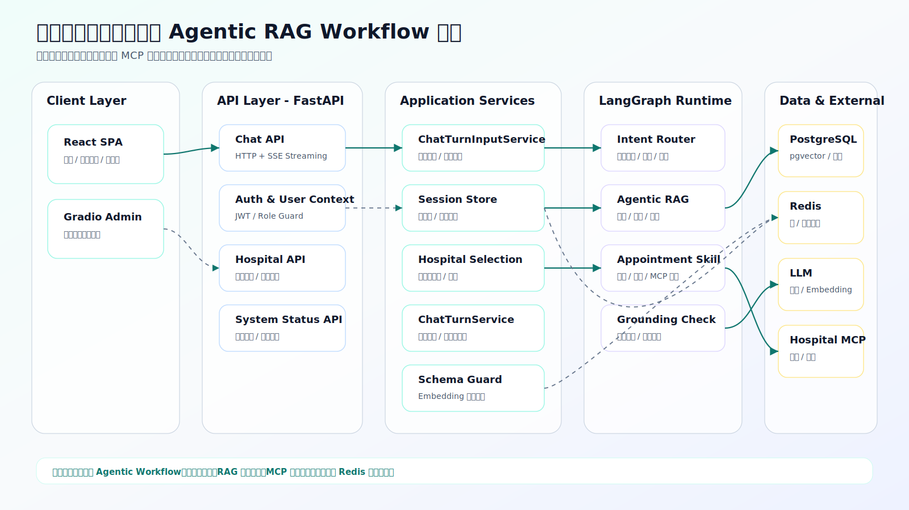
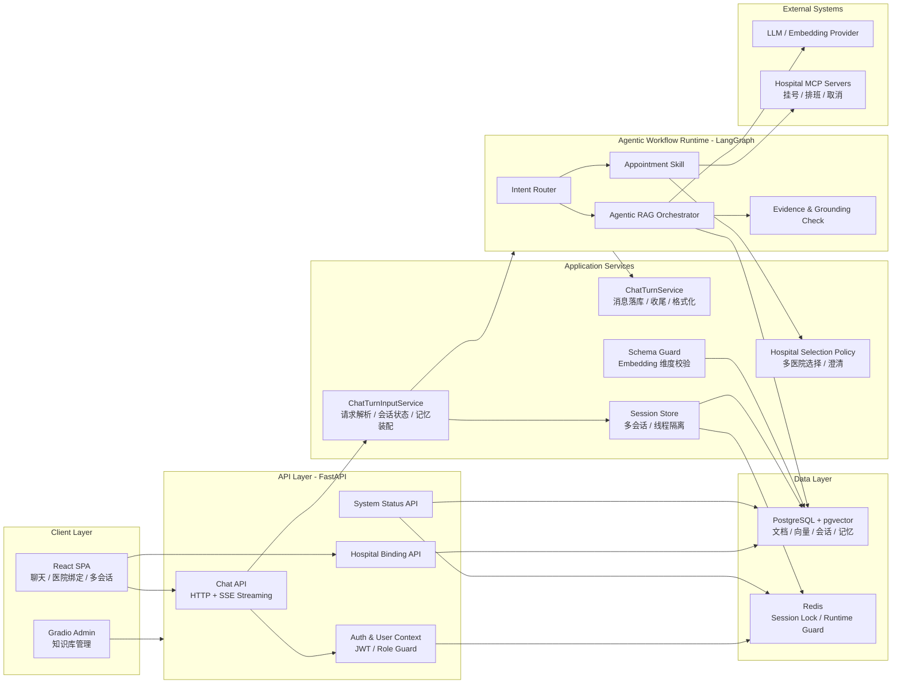
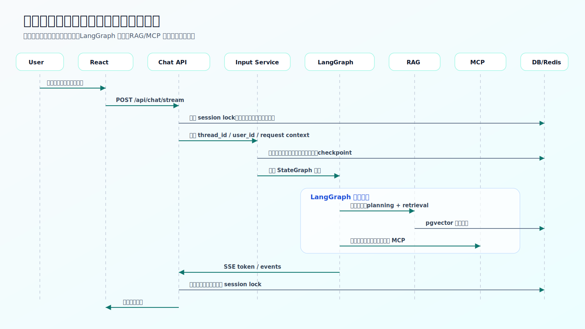
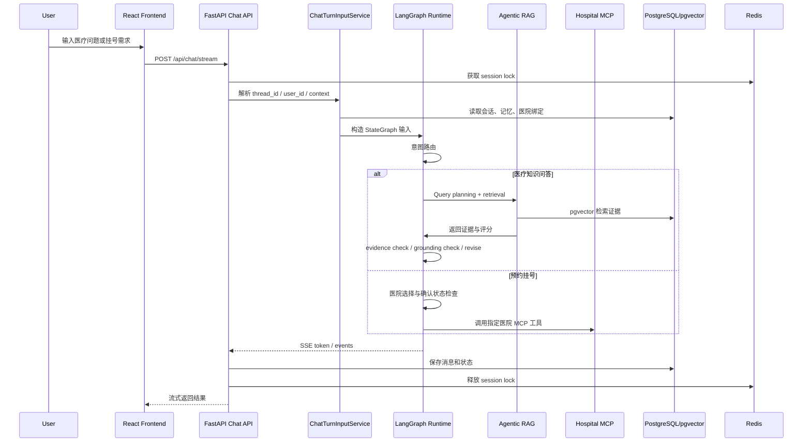
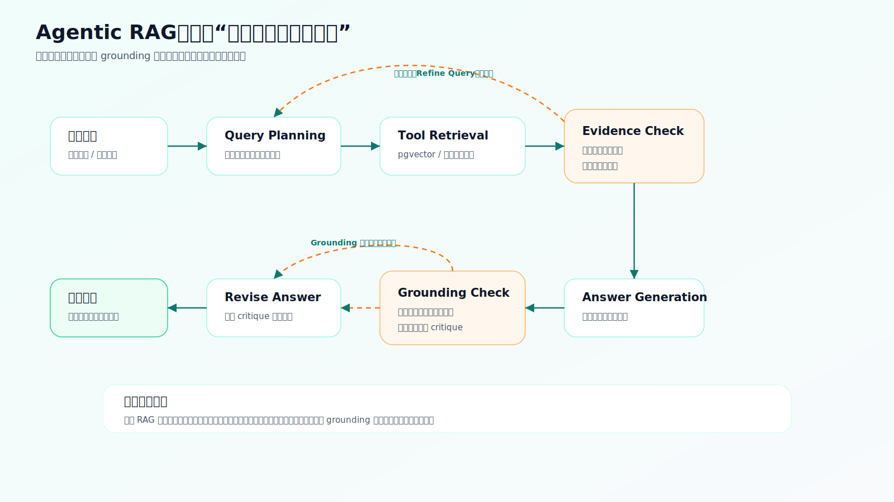
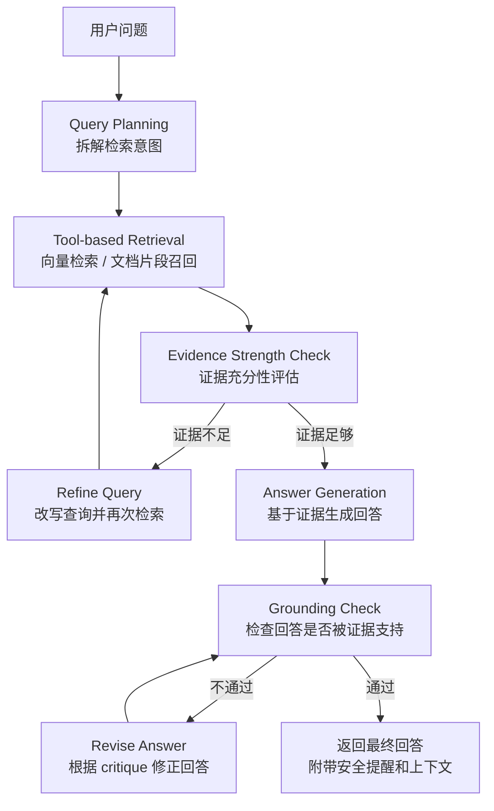
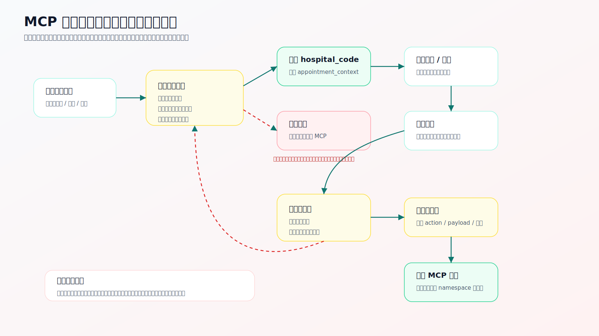
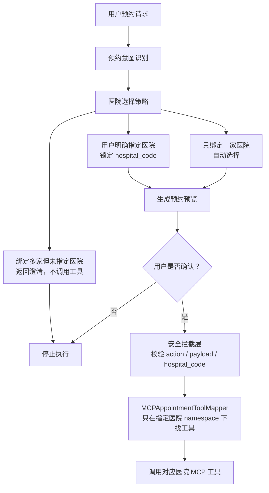

# 心语医疗小助手项目面试架构说明

这份文档用于面试时快速介绍项目。建议先讲“项目定位”，再讲“系统架构图”，最后根据面试官追问选择讲 RAG 链路或 MCP 挂号安全链路。

图片文件已经单独生成到 `docs/architecture/` 目录。面试现场如果 Markdown 预览不稳定，可以直接打开这些 SVG 图片：

- `docs/architecture/interview-system-architecture.svg`
- `docs/architecture/interview-request-sequence.svg`
- `docs/architecture/interview-agentic-rag-loop.svg`
- `docs/architecture/interview-mcp-safety-boundary.svg`

## 1. 一句话介绍

心语医疗小助手是一个面向医疗咨询、知识库问答和预约挂号场景的 Agentic RAG Workflow 系统。

它不是完全开放式 Autonomous Agent，而是基于 LangGraph 编排的可控 Agentic Workflow：模型参与意图识别、检索规划、证据评估、回答生成和工具调用，但关键流程由状态机、权限、会话锁和预约确认机制约束，适合医疗这种高风险场景。

可以这样对面试官说：

> 这个项目的核心不是做一个让模型自由行动的通用 Agent，而是做一个医疗场景下可控、可审计、可扩展的 Agentic RAG Workflow。系统用 LangGraph 编排对话流程，用 PostgreSQL 和 pgvector 做知识检索和记忆存储，用 Redis 做运行态锁和安全保护，通过 MCP 接入外部医院工具，并且对预约挂号这类高风险动作做了医院选择、预览和用户确认。

## 2. 系统分层架构图

这张图用于开场，说明系统边界、模块职责和外部依赖。

下面的 Mermaid 代码是图片的源逻辑，主要用于后续维护；面试展示建议直接看上面的 SVG 图片。

讲解重点：

- 前端是 React SPA，负责聊天、医院绑定、知识库页面和多会话交互。
- 后端是 FastAPI，提供登录鉴权、聊天流式接口、医院绑定接口和系统状态接口。
- 核心推理不是写在一个大函数里，而是由 LangGraph 编排成多个节点。
- 数据层用 PostgreSQL/pgvector 存知识库、向量、会话和长期记忆。
- Redis 用于 session lock 和运行态保护，支持以后多 worker 部署。
- 外部医院能力通过 MCP 接入，不直接把医院工具散落在业务代码里。

## 3. 核心请求时序图

这张图用于回答：“用户发一条消息后，系统内部到底怎么跑？”

下面的 Mermaid 代码是图片的源逻辑，主要用于后续维护；面试展示建议直接看上面的 SVG 图片。

讲解重点：

- 每个用户会话都有自己的 thread_id，后端通过 session store 做线程隔离。
- 流式输出用 SSE，用户体验上能边生成边展示。
- 进入 LangGraph 前，会先装配会话状态、用户身份、长期记忆和医院绑定信息。
- 对于医疗问答，系统走 RAG 和 grounding 校验。
- 对于预约挂号，系统走 appointment skill 和 MCP 工具层。

## 4. Agentic RAG 链路

这张图用于说明为什么它不是普通 RAG。

下面的 Mermaid 代码是图片的源逻辑，主要用于后续维护；面试展示建议直接看上面的 SVG 图片。

可以这样讲：

> 传统 RAG 往往是检索一次，然后把结果塞给模型回答。我这里做的是 Agentic RAG：先做 query planning，再调用检索工具，之后对证据强度进行评估。如果证据不足，会进入反思循环改写查询重新检索。生成回答之后，还会做 grounding check，检查回答是否被证据支持，如果不通过就修正回答。这样可以降低医疗问答里的幻觉风险。

## 5. MCP 挂号安全边界

这张图用于回答：“怎么防止 AI 不小心帮用户挂错号？”

下面的 Mermaid 代码是图片的源逻辑，主要用于后续维护；面试展示建议直接看上面的 SVG 图片。

讲解重点：

- 用户如果绑定多家医院但没说清楚，系统不会默认选第一家，会先澄清。
- 一旦进入预约预览，就把 hospital_code 和 hospital_name 写入 pending_action_payload。
- 用户确认后，系统只允许调用 payload 中指定医院的 MCP 工具。
- mapper 支持 preferred_hospital_code，不会因为工具名匹配顺序误选其他医院。
- 预约、取消、改约都要沿用同一家医院上下文。

可以这样讲：

> 医疗预约是高风险动作，所以我没有让模型直接调用挂号工具。系统先明确医院，再查询医生和排班，生成预约预览，最后必须用户确认才真正执行。确认阶段还会锁定 hospital_code，工具映射层只在对应医院 namespace 下查找工具，避免多医院绑定时误调用别家医院的 MCP 工具。

## 6. 工程治理和上线准备

这部分用于说明项目不是只停留在 demo。

### 已经做的工程治理

- 会话隔离：多会话 thread_id，用户只能访问自己的会话。
- 分布式保护：Redis-backed session lock，避免同一会话并发写乱状态。
- 鉴权保护：JWT 登录、角色校验、Redis-backed auth runtime guard。
- 数据一致性：embedding dimension schema guard，启动期检查 pgvector 列维度。
- 可观测性：`/api/system/status` 暴露 runtime backends、schema health、知识库状态。
- 医院 MCP 安全：多医院选择策略、预约预览、确认执行、工具 namespace 限制。
- Docker 部署：本地已整理 Docker Compose，可把 API、前端、PostgreSQL、Redis 组合运行。

### 还可以继续优化

- 引入 Alembic 做正式数据库迁移管理。
- 增加生产级日志、trace id 和 OpenTelemetry。
- 把 MCP tool mapping 从配置文件升级为数据库表或管理后台。
- 给 RAG 检索质量加离线评测集和自动化评估。
- 对医疗回答增加更严格的免责声明、风险分级和人工转诊策略。

## 7. 面试讲解顺序

建议按这个顺序讲，时间控制在 5 到 8 分钟。

1. 项目定位

   > 这是一个医疗场景下的 Agentic RAG Workflow，不是开放式 Agent。这样设计是因为医疗场景需要更强的可控性和安全边界。

2. 系统架构

   讲第 2 节分层架构图，重点说 React、FastAPI、LangGraph、PostgreSQL/pgvector、Redis、MCP 的职责。

3. 核心技术亮点

   讲第 4 节 Agentic RAG 链路，强调 query planning、证据评估、grounding check 和 revise loop。

4. 安全设计

   讲第 5 节 MCP 挂号安全边界，强调多医院选择、预约预览、用户确认、hospital_code 锁定。

5. 工程化能力

   讲会话隔离、Redis lock、schema guard、系统状态接口、Docker 部署。

## 8. 高频追问回答

### Q1：这个项目算 Agent 吗？

可以回答：

> 我不会把它描述成完全自主的 Agent，而会说它是 Agentic Workflow。它具备 Agent 的部分能力，比如意图路由、工具调用、反思检索和回答修正；但关键流程由 LangGraph 状态机约束，尤其是医疗预约这种高风险动作必须走确认机制。这种设计比开放式 Agent 更适合医疗场景。

### Q2：你怎么降低 AI 幻觉？

可以回答：

> 主要靠三层机制。第一层是 RAG，回答必须基于知识库证据。第二层是 evidence strength check，如果证据不足，会改写查询重新检索。第三层是 grounding check，生成回答后再判断回答是否被证据支持，不通过就进入 revise answer。这样不是完全消灭幻觉，但能把风险从“模型自由编”压到“围绕证据回答”。

### Q3：MCP 医院工具怎么接？

可以回答：

> 医院侧提供 MCP server，暴露查询医生、查询排班、预约、取消等工具。项目内部不直接按自然语言随便找工具，而是通过 MCPAppointmentToolMapper 做标准动作到医院工具的映射。多医院场景下会先确定 hospital_code，然后只在这个医院 namespace 下查找工具，避免误调用其他医院。

### Q4：为什么需要 Redis？

可以回答：

> Redis 主要用于运行态保护。比如同一用户同一会话不能同时有多个请求写状态，所以需要 session lock。还有 auth runtime guard 和 fallback 状态也可以通过 Redis 暴露。这样项目从单进程 demo 往多 worker 部署演进时，不会依赖进程内锁。

### Q5：如果上线，你还会补什么？

可以回答：

> 我会优先补三类能力。第一是生产数据库迁移，比如 Alembic。第二是可观测性，比如结构化日志、trace id、错误告警。第三是安全合规，比如医疗免责声明、敏感操作审计、MCP 工具调用审计和更严格的权限控制。

## 9. 一分钟版本

如果面试官只给很短时间，可以这样讲：

> 我的项目是一个医疗咨询和预约挂号场景的 Agentic RAG Workflow。前端用 React，后端用 FastAPI，核心流程用 LangGraph 编排。医疗问答不是简单检索一次就回答，而是 query planning、向量检索、证据强度评估、回答生成、grounding check 和必要时修正回答。挂号能力通过 MCP 接入医院工具，但系统不会让模型直接挂号，而是先选择医院、查询排班、生成预约预览，最后用户确认后才调用对应医院工具。工程上我做了多会话隔离、Redis session lock、JWT 鉴权、pgvector schema guard、系统状态接口和 Docker 部署准备，所以它不只是 demo，而是朝生产化方向整理过的医疗 Agentic RAG 应用。
