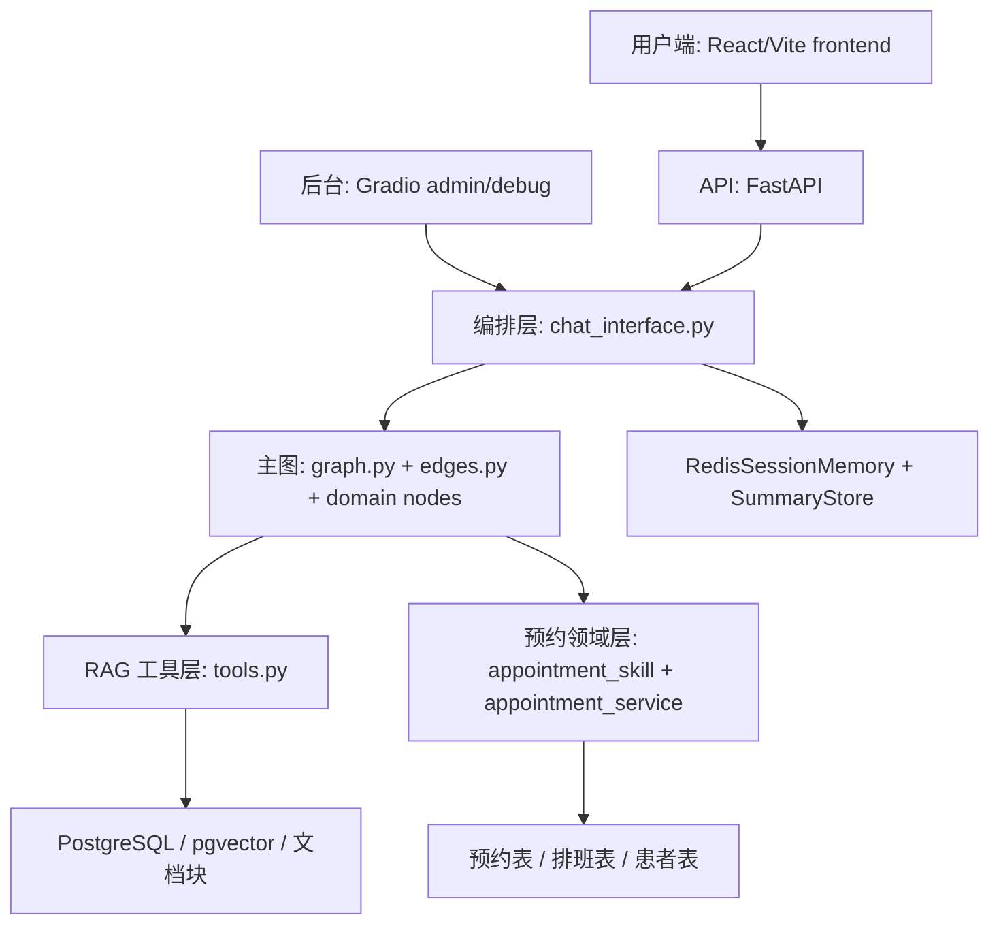
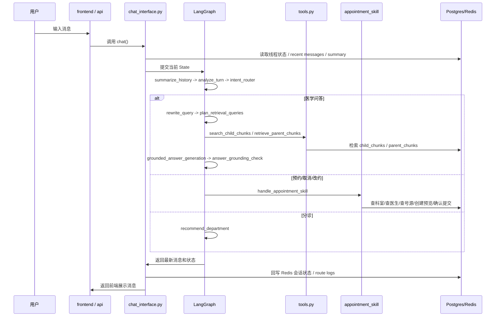

# 项目导读（中文）

## 1. 这个项目是做什么的

这个项目不是单一的聊天机器人，而是一个围绕“医疗助手”场景搭起来的多能力系统。它目前主要有四条能力线：

1. 医学知识问答  
   基于本地知识库、PostgreSQL/pgvector、关键词检索和分层召回来回答医疗相关问题。

2. 分诊与导诊  
   用户问“挂什么科”时，系统会优先推荐科室。

3. 预约、取消、改约  
   通过纯对话方式完成发现号源、选择医生、生成预览、确认提交。

4. 文档导入与知识库建设  
   支持导入本地 Markdown/PDF，也支持抓取 MedlinePlus、国家卫健委、WHO 的官方材料并入库。

这个项目已经不再是简单的“RAG Demo”，而是：

- 有 UI
- 有图编排
- 有 RAG
- 有预约事务
- 有状态记忆
- 有评估和日志

你可以把它理解成：  
**一个医疗 AI 助手产品原型，而不是单文件问答脚本。**

当前主线已经是前后端分离形态：

- `frontend/` 是 React/Vite 用户聊天端
- `project/api/` 是 FastAPI 后端 API
- `project/ui/` 的 Gradio 继续作为文档管理和诊断后台

`frontend/src/` 内部再分三块：

- `components/`：聊天页面 UI 组件
- `lib/`：API 请求、流式聊天协议适配等浏览器侧逻辑
- `constants/`：前端常量、示例问题、状态 tone 映射

---

## 2. 先看哪些文件，最容易理解项目

如果你想快速建立整体认识，建议按这个顺序读：

1. `D:\nageoffer\agentic-rag-for-dummies\project\api_app.py` 和 `D:\nageoffer\agentic-rag-for-dummies\project\api\app.py`
   FastAPI 用户端入口，是当前主线 API 启动方式。

2. `D:\nageoffer\agentic-rag-for-dummies\frontend\src\App.jsx`
   React 用户聊天端，负责 thread_id 持久化、流式消息接收和界面状态管理。

3. `D:\nageoffer\agentic-rag-for-dummies\project\app.py`
   Gradio 管理/调试台入口。

4. `D:\nageoffer\agentic-rag-for-dummies\project\ui\gradio_app.py`  
   Gradio 后台页面，负责文档管理、官方同步和诊断查看。

5. `D:\nageoffer\agentic-rag-for-dummies\project\core\chat_interface.py`  
   UI 和后端图之间的桥梁，是“请求总编排器”。

6. `D:\nageoffer\agentic-rag-for-dummies\project\rag_agent\graph.py`  
   主图和子图怎么连接。

7. `D:\nageoffer\agentic-rag-for-dummies\project\rag_agent\routing_nodes.py`  
   路由、复合请求拆分、澄清恢复的图节点入口。

8. `D:\nageoffer\agentic-rag-for-dummies\project\rag_agent\rag_nodes.py` 和 `D:\nageoffer\agentic-rag-for-dummies\project\rag_agent\tools.py`  
   RAG 真正怎么检索、怎么打分、怎么兜底。

9. `D:\nageoffer\agentic-rag-for-dummies\project\rag_agent\appointment_nodes.py` 和 `D:\nageoffer\agentic-rag-for-dummies\project\services\appointment_skill\skill.py`  
   挂号领域能力的统一入口。

10. `D:\nageoffer\agentic-rag-for-dummies\project\services\appointment_service.py`  
   数据库事务层，最终怎么创建预约、取消预约、改约。

如果只想先看图编排，就看 `graph.py`；如果想理解行为，就按 `routing_nodes.py -> appointment_nodes.py / rag_nodes.py -> tools.py` 的顺序看。

`nodes.py` 目前仍存在，但新的维护入口已经按领域拆到 `routing_nodes.py`、`rag_nodes.py` 和 `appointment_nodes.py`，阅读主线时优先看这些模块。

---

## 3. 顶层目录怎么理解

仓库里最重要的目录是这些：

- `project/`  
  主要代码都在这里。

- `frontend/`  
  React/Vite 用户聊天端，和 FastAPI 通过 HTTP 流式接口通信。页面组件在 `src/components/`，请求与流式 helper 在 `src/lib/`，前端常量在 `src/constants/`。

- `docs/`  
  文档说明，比如导入资料、评估、Postgres 配置。

- `markdown_docs/`  
  本地 Markdown 知识库文档目录。这里是“知识源”的本地落地区。

- `tests/`  
  自动化测试。现在已经覆盖了预约、RAG、路由、导入、评估等主流程。

`project/` 下面再分 8 个子域：

- `project/api/`  
  FastAPI API 层，负责用户端会话、状态和流式聊天接口。

- `project/core/`  
  系统总编排，比如 `RAGSystem`、`ChatInterface`、文档管理器。

- `project/rag_agent/`  
  LangGraph 图、节点、边、提示词、工具、状态定义。

- `project/services/`  
  领域服务层。现在最重要的是预约服务和 appointment skill。

- `project/db/`  
  PostgreSQL/pgvector 相关的存储实现、schema 管理、日志表、父块/子块存储。

- `project/memory/`  
  Redis 会话记忆和对话摘要存储。

- `project/ui/`  
  Gradio 页面和样式。

- `project/assets/`  
  页面图片等静态资源。

---

## 4. 整体架构一句话理解

你可以把整个系统拆成下面这 5 层：

更口语一点：

- 前端收消息
- `ChatInterface` 组织线程状态
- LangGraph 决定这一轮走哪条链路
- 医学问答走 RAG
- 挂号取消走 appointment skill
- 所有状态再回写到 Redis / Postgres

---

## 5. 程序从哪里启动

当前主入口分成两类：

- 用户端主入口：`D:\nageoffer\agentic-rag-for-dummies\project\api_app.py`
- 管理/调试台入口：`D:\nageoffer\agentic-rag-for-dummies\project\app.py`

`app.py` 做的事非常少，主要是：

1. 调 `create_gradio_ui()`
2. 拿到 Gradio demo
3. `launch(show_error=True)`

真正重的初始化在：

- `D:\nageoffer\agentic-rag-for-dummies\project\core\rag_system.py`

`RAGSystem` 负责：

- 初始化向量库对象
- 初始化 parent store
- 初始化 Redis session memory
- 初始化 summary store
- 初始化 appointment service
- 初始化模型
- 创建 agent graph
- 后台检查知识库状态
- 必要时自动补索引

所以：

- `api_app.py` / FastAPI 是当前用户端主入口
- `app.py` 是管理/调试台外壳
- `RAGSystem` 才是系统总装配器

---

## 6. 一次对话请求是怎么流动的

最关键的是这条链：

这里最重要的不是“有没有图”，而是：

- 所有用户请求都会先进 `ChatInterface`
- 所有正式业务路由都在图内完成
- UI 本身不做业务判断

---

## 7. `ChatInterface` 是干什么的

文件：

- `D:\nageoffer\agentic-rag-for-dummies\project\core\chat_interface.py`

它的角色不是“回答问题”，而是“把前端和图粘起来”。

主要职责：

1. 恢复当前线程状态  
   包括：
   - Redis 里的短期状态
   - recent messages
   - appointment pending 状态
   - clarification 状态

2. 生成图需要的 state  
   包括：
   - `thread_id`
   - `messages`
   - `conversation_summary`
   - `pending_action_type`
   - `appointment_context`

3. 调用 LangGraph  
   真正的逻辑不是它做，而是它把状态送进图里。

4. 处理前端展示  
   它会过滤一些不该直接给用户看的内部消息，比如诊断节点、系统节点等。

5. 写日志和状态  
   比如 route logs、retrieval context、session state。

所以 `ChatInterface` 的定位可以记成：

**会话层编排器**

---

## 8. LangGraph 主图是怎么组织的

文件：

- `D:\nageoffer\agentic-rag-for-dummies\project\rag_agent\graph.py`
- `D:\nageoffer\agentic-rag-for-dummies\project\rag_agent\edges.py`
- `D:\nageoffer\agentic-rag-for-dummies\project\rag_agent\graph_state.py`
- `D:\nageoffer\agentic-rag-for-dummies\project\rag_agent\routing_nodes.py`
- `D:\nageoffer\agentic-rag-for-dummies\project\rag_agent\rag_nodes.py`
- `D:\nageoffer\agentic-rag-for-dummies\project\rag_agent\appointment_nodes.py`

主图里最关键的节点顺序是：

1. `summarize_history`
2. `analyze_turn`
3. `intent_router`
4. 进入某条业务分支：
   - `rewrite_query`
   - `recommend_department`
   - `handle_appointment_skill`
   - `request_clarification`

### 8.1 `analyze_turn` 是做什么的

`analyze_turn` 不是最终回答节点，而是“当前回合分析器”。

它负责：

- 识别这是不是继续上一轮 pending/clarification
- 提取 `recent_context`
- 提取 `topic_focus`
- 识别复合请求
- 拆出：
  - `primary_intent`
  - `secondary_intent`
  - `deferred_user_question`

比如：

- “取消刚才那个预约，然后我这个咳嗽还要看吗”

它会拆成：

- 主意图：`cancel_appointment`
- 次意图：`medical_rag`

### 8.2 `intent_router` 是做什么的

`intent_router` 是正式业务路由器。

它最终决定这一轮走：

- `medical_rag`
- `triage`
- `appointment`
- `cancel_appointment`
- `clarification`
- `greeting`

这个项目现在已经把“正式业务路由”统一收口到图内了，不再是 UI 一套、图内一套。

---

## 9. RAG 主流程怎么工作

RAG 相关核心文件：

- `D:\nageoffer\agentic-rag-for-dummies\project\rag_agent\rag_nodes.py`
- `D:\nageoffer\agentic-rag-for-dummies\project\rag_agent\tools.py`
- `D:\nageoffer\agentic-rag-for-dummies\project\db\vector_db_manager.py`
- `D:\nageoffer\agentic-rag-for-dummies\project\db\parent_store_manager.py`

### 9.1 主流程

医学问题一般会走这条线：

1. `rewrite_query`
2. `plan_retrieval_queries`
3. `agent` 子图并行检索
4. `grounded_answer_generation`
5. `answer_grounding_check`

### 9.2 检索不是单一向量搜

现在是：

- 向量检索：pgvector
- 关键词检索：tsvector / GIN
- 融合：RRF
- 分层排序：
  - `patient_education`
  - `public_health`
  - `clinical_guideline`
  - `research_article`

### 9.3 查询不是单路

`plan_queries()` 会生成 2 到 4 条查询表达，比如：

- 原问题
- 带主题的改写问题
- 带上下文的 follow-up 改写
- 领域术语式查询

所以它不是“只搜一次原句”，而是多 query 召回再融合。

### 9.4 证据不足时怎么处理

这个项目已经做了两个重要兜底：

- 如果有证据但弱，会给 `low/medium/high` 的 `confidence_bucket`
- 如果没有足够证据，但问题是医学问题，会进入“通用医学信息回答”模式，并带安全提醒

也就是说现在不是“搜不到就死拒答”，而是：

- 医学问题：可保守回答并提醒
- 非医学问题：可自然回答

---

## 10. RAG 里最关键的工具有哪些

文件：

- `D:\nageoffer\agentic-rag-for-dummies\project\rag_agent\tools.py`

这里最关键的是这几块：

### `plan_queries()`

作用：

- 把一个问题变成多个检索表达
- 对 follow-up 问题做主题展开

### `grade_documents()`

作用：

- 对召回结果做相关性过滤
- 去掉明显弱相关 chunk

### `check_sufficiency()`

作用：

- 判断当前证据够不够回答问题
- 不够时触发一次 retry query

### `ground_answer()`

作用：

- 对低证据/无证据回答做安全落地
- 对医学问题自动加提醒

### `ToolFactory.create_tools()`

作用：

- 把检索、父块读取等能力注册成 LangChain tools

---

## 11. appointment skill 怎么理解

这个项目的预约逻辑，已经不是“一个预约节点 + 一个取消节点”那么简单了。

现在它被收口成一个内部领域包：

- `D:\nageoffer\agentic-rag-for-dummies\project\services\appointment_skill\`

里面拆成了几个子模块：

- `catalog.py`  
  只读查询能力：
  - 查科室
  - 查医生
  - 查某医生时段
  - 查我的预约

- `planner.py`  
  候选方案能力：
  - 替代医生
  - 替代时段

- `actions.py`  
  负责生成预览对象：
  - 预约预览
  - 取消预览
  - 改约预览

- `dialog_policy.py`  
  负责把 discovery / planning 结果格式化成用户能看的对话文案。

- `schemas.py`  
  定义预约领域的数据结构。

统一入口在：

- `D:\nageoffer\agentic-rag-for-dummies\project\services\appointment_skill\__init__.py`

---

## 12. 预约流程怎么走

现在预约已经是**渐进式披露**了，不要求用户一次性说全。

### 12.1 discovery

用户可能会先说：

- 我要挂号
- 呼吸内科有哪些医生
- 张医生有号吗
- 我现在挂了谁的号

这一步只查，不提交写操作。

### 12.2 planning

当信息足够时，系统会生成预览：

- 预约预览
- 取消预览
- 改约预览

### 12.3 confirm

真正写数据库之前，必须明确确认。

比如：

- `确认预约`
- `确认取消`

这就是现在的“半受控 Function Calling”思想：

- 模型可以提议动作
- 但程序控制执行

---

## 13. 预约底层事务层做什么

文件：

- `D:\nageoffer\agentic-rag-for-dummies\project\services\appointment_service.py`

这是最靠数据库的一层。

它负责：

- 根据线程绑定 patient
- 查科室
- 查医生排班
- 查号源
- 创建预约
- 取消预约
- 改约

你可以把它理解成：

**医院挂号数据库事务服务**

而 `appointment_skill` 是：

**面向对话交互的业务包装层**

---

## 14. 会话记忆怎么做的

记忆不是只有一层。

### 14.1 短期状态

文件：

- `D:\nageoffer\agentic-rag-for-dummies\project\memory\redis_memory.py`

负责保存：

- 当前线程 state
- recent messages
- pending action
- pending clarification

### 14.2 长一点的摘要

文件：

- `D:\nageoffer\agentic-rag-for-dummies\project\memory\summary_store.py`

负责把历史对话压成摘要，防止上下文无限膨胀。

### 14.3 图内显式状态字段

文件：

- `D:\nageoffer\agentic-rag-for-dummies\project\rag_agent\graph_state.py`

里面比较关键的字段有：

- `recent_context`
- `topic_focus`
- `conversation_summary`
- `primary_intent`
- `secondary_intent`
- `deferred_user_question`
- `pending_action_type`
- `pending_action_payload`
- `pending_candidates`
- `appointment_context`

这就是为什么项目会显得“复杂”：  
它不是只靠大模型上下文记忆，而是显式维护了一套会话状态机。

---

## 15. 知识库文档是怎么进来的

文件：

- `D:\nageoffer\agentic-rag-for-dummies\project\core\document_manager.py`
- `D:\nageoffer\agentic-rag-for-dummies\project\core\medical_source_ingest.py`
- `D:\nageoffer\agentic-rag-for-dummies\project\core\document_chunker.py`

### 本地导入

支持：

- Markdown
- PDF

会先落到：

- `markdown_docs/`

然后再做：

- parent chunk
- child chunk
- 向量入库

### 官方文档导入

支持：

- MedlinePlus
- 国家卫健委 PDF 白名单
- WHO Fact Sheets

这些资料会被转成 Markdown，再进入相同的 chunk / 入库流程。

---

## 16. 数据库存了什么

这个项目现在以 PostgreSQL 为核心存储，不只是向量。

主要有几类数据：

1. 知识库文档和 chunk  
   包括：
   - documents
   - parent chunks
   - child chunks

2. 预约相关  
   包括：
   - departments
   - doctors
   - doctor_schedules
   - appointments
   - patients
   - chat_sessions

3. 会话与日志  
   包括：
   - summaries
   - retrieval logs
   - route logs
   - appointment skill logs
   - import task logs

核心文件在：

- `D:\nageoffer\agentic-rag-for-dummies\project\db\schema_manager.py`
- `D:\nageoffer\agentic-rag-for-dummies\project\db\vector_db_manager.py`
- `D:\nageoffer\agentic-rag-for-dummies\project\db\route_log_store.py`
- `D:\nageoffer\agentic-rag-for-dummies\project\db\appointment_skill_log_store.py`

---

## 17. 为什么项目会越来越难懂

本质原因不是“代码写得乱”，而是这个项目已经叠了多种系统职责：

1. UI 系统
2. 对话系统
3. 图编排系统
4. 检索系统
5. 预约事务系统
6. 会话状态系统
7. 评估与日志系统

当你只看单个文件时，很容易迷失，因为每个文件都只承担一部分责任。

比较好的理解方式是：

- 不要先按“文件夹”理解
- 要先按“请求流”理解

也就是：

**用户说一句话 -> 系统怎么一步步处理 -> 最后怎么回给用户**

只要这个主线清楚了，再回头看文件，就会容易很多。

---

## 18. 推荐的阅读路线

如果你想真正把项目吃透，建议分 3 轮看。

### 第一轮：只看主流程

看这些：

- `project/api_app.py`
- `frontend/src/App.jsx`
- `project/core/chat_interface.py`
- `project/rag_agent/graph.py`

目标：

- 弄清用户请求怎么从前端进来、怎么经过 API 和图再返回

### 第二轮：分开看两条业务线

先看 RAG：

- `project/rag_agent/rag_nodes.py`
- `project/rag_agent/tools.py`

再看预约：

- `project/rag_agent/appointment_nodes.py`
- `project/services/appointment_skill/__init__.py`
- `project/services/appointment_service.py`

目标：

- 医学问答线怎么工作
- 预约线怎么工作

### 第三轮：再看状态和评估

看这些：

- `project/rag_agent/graph_state.py`
- `project/memory/redis_memory.py`
- `project/memory/summary_store.py`
- `project/core/qa_eval.py`
- `project/benchmarks/evaluate_qa_quality.py`
- `project/benchmarks/evaluate_route_quality.py`

目标：

- 搞清楚为什么系统“记得住”
- 搞清楚为什么系统能做回归评估

---

## 19. 如果你现在只想记住一件事

最重要的不是记住所有文件名，而是记住这句话：

**这个项目的核心是：`ChatInterface` 组织线程状态，LangGraph 决定业务路由，RAG 负责医学问答，Appointment Skill 负责挂号事务。**

只要这句话你能抓住，后面很多细节都会顺下来。

---

## 20. 下一步建议

如果你后面还想继续理解代码，我建议按下面顺序继续：

1. 先单独走读 `chat_interface.py`
2. 再单独走读 `graph.py + edges.py`
3. 再单独走读这 4 个关键函数：
   - `analyze_turn`
   - `intent_router`
   - `handle_appointment_skill`
   - `grounded_answer_generation`
4. 最后再看 `tools.py`

如果你愿意，我下一步可以继续帮你做两种导读中的一种：

1. **时序图版导读**  
   按“用户一句话 -> 各函数如何调用”画成更细的流程图。

2. **源码走读版导读**  
   我按文件一段一段讲，像带你过代码审查一样解释。
